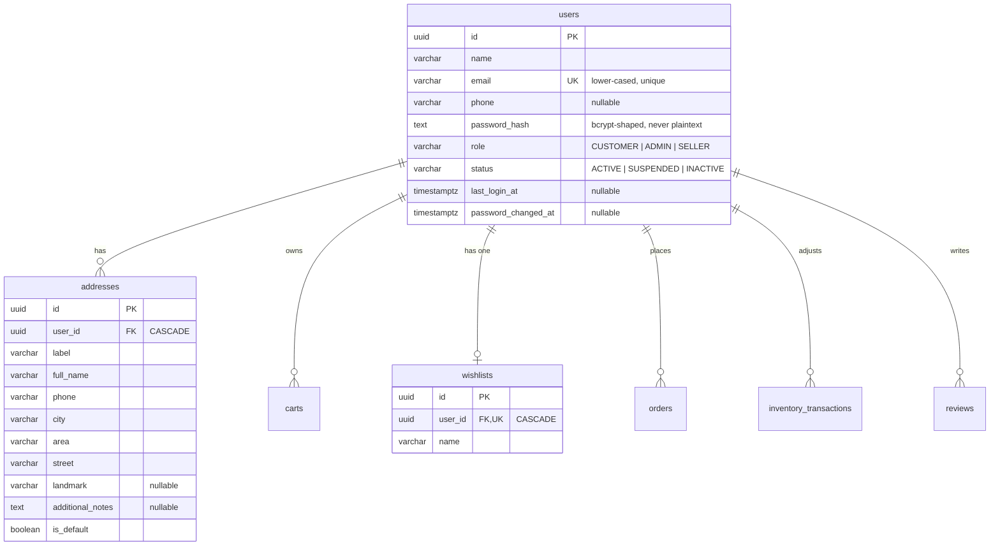
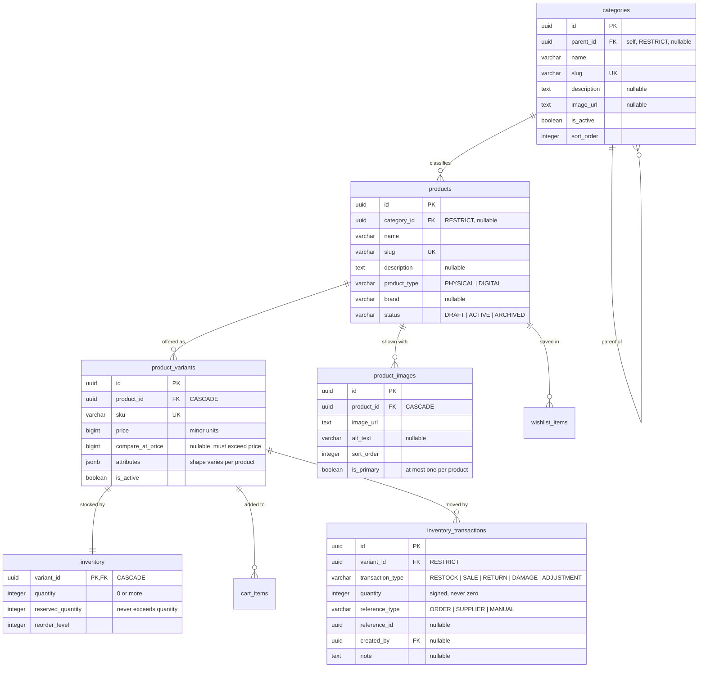
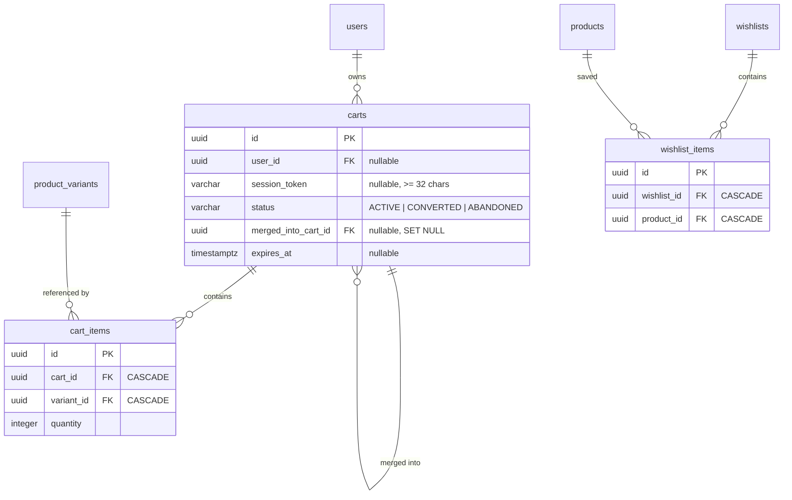
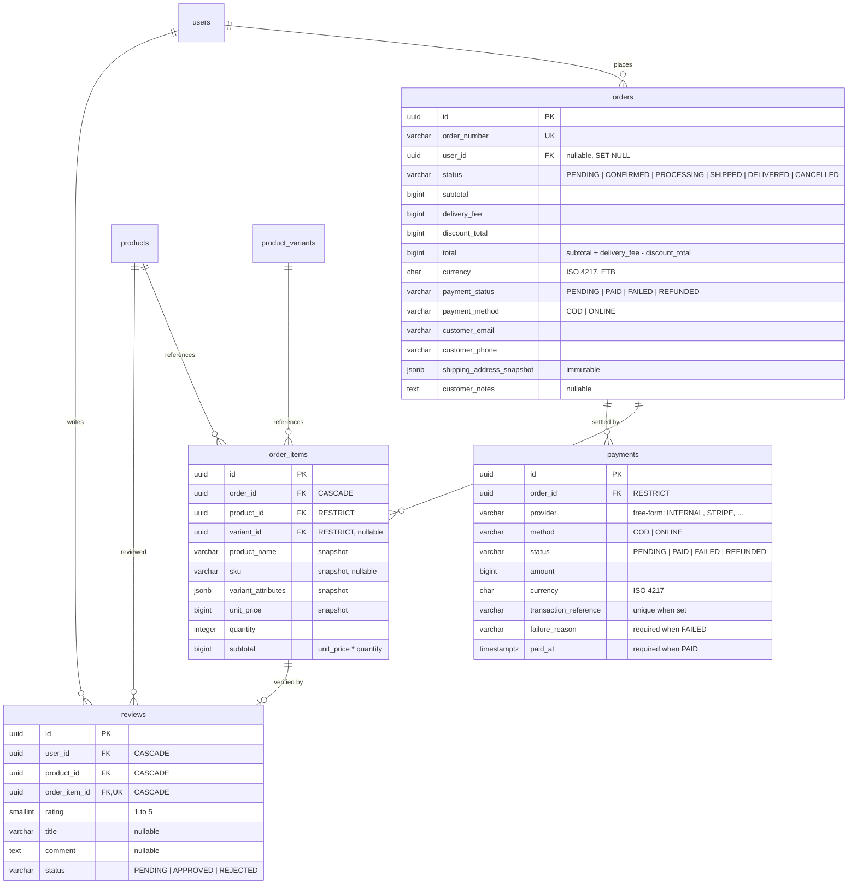

# Database schema

The store runs on PostgreSQL 14 or newer. The schema is built by the flat,
numbered migration files in `backend/migrations/`, and every table below exists
there — this document describes what was built, not a plan.

- [Conventions](#conventions)
- [Entity relationship diagram](#entity-relationship-diagram)
- [Table reference](#table-reference)
- [How the schema enforces the rules](#how-the-schema-enforces-the-rules)
- [Verifying it](#verifying-it)
- [Running it](#running-it)

## Conventions

| Decision         | Choice                                                                   | Why                                                                                                                                                                            |
| ---------------- | ------------------------------------------------------------------------ | ------------------------------------------------------------------------------------------------------------------------------------------------------------------------------ |
| Primary keys     | `UUID`, default `gen_random_uuid()`                                      | Ids can be created on the client before the row is inserted, which matters for carts and orders created in one round trip. Built into PostgreSQL 13+, so no extension.         |
| Money            | `BIGINT` minor units                                                     | Never floating point. An amount of `1870000` is 18,700.00 ETB. The currency lives on `orders` and `payments`; prices are implicitly in the store currency.                     |
| Timestamps       | `TIMESTAMPTZ`, always `NOT NULL DEFAULT NOW()`                           | `timestamptz` stores an absolute instant, so it survives a timezone change. No `timestamp without time zone` anywhere.                                                         |
| Enumerations     | `VARCHAR` plus a `CHECK`                                                 | Postgres enums are hard to alter once data exists. A `CHECK` reads the same way, can be changed in a migration, and keeps invalid data out. All values are `UPPER_SNAKE_CASE`. |
| Free-form values | `VARCHAR` with a documented range                                        | `payments.provider` is free-form on purpose so a Telebirr or Stripe integration needs no schema change. Enumerations only cover values the application itself controls.        |
| Deletion         | `RESTRICT` on anything that has been bought, `CASCADE` on owned children | An order line must never be orphaned from its order, and a purchased product must never vanish from history.                                                                   |
| Naming           | `snake_case` tables, `snake_case` columns, singular table names          | `product_variants`, `user_id`, `created_at`.                                                                                                                                   |

`inventory_transactions` is the only table with no `updated_at`: a stock ledger
is append-only, so a row must never change after it is written. Migration
`018` attaches a `set_updated_at` trigger to the other 15 mutable tables.

## Entity relationship diagram

Four diagrams, one per area, because a single diagram with 16 tables is
unreadable. Every arrow below is a real `FOREIGN KEY` in the migrations.

### Identity



`wishlists.user_id` is unique, so every customer has exactly one default
wishlist. A second wishlist per user is a product decision for later, and would
mean dropping that constraint.

### Catalogue



`products` deliberately has no `price` and no `stock` column. Price belongs to
the variant, because "Nike Air Max 270 in black, size 42" is what has a price.
Stock belongs to the variant for the same reason, and it lives in a separate
`inventory` row so the ledger never shares a table with the current balance.

`product_variants.attributes` is `JSONB` because attribute shapes differ by
product: `{"storage":"256GB","ram":"8GB"}` for a phone, `{"color":"Black","size":"42"}`
for shoes. A `CHECK` requires it to be a JSON object, so it can never hold a
scalar or an array.

### Cart and wishlist



A cart belongs to exactly one owner, enforced by
`(user_id IS NULL) <> (session_token IS NULL)`: a row must have a user **or** a
session token, never both and never neither. Guest carts expire; user carts do
not.

Cart lines reference a **variant** and store no price. Totals are computed by
the cart service from `product_variants.price`, so a stale cached total cannot
be shown to a customer.

### Orders, payments and reviews



An order is one row per checkout and keeps a full copy of the delivery address
in `shipping_address_snapshot`. Each `order_items` row copies the product name,
SKU, variant attributes and unit price. Editing an address or changing a price
later leaves past orders exactly as they were.

`orders.user_id` is nullable so guest checkout needs no account. It is
`ON DELETE SET NULL`, and `customer_email` is kept on the order so the row
survives account deletion intact.

## Table reference

| Table                    | Rows seeded | Purpose                                                                                                     |
| ------------------------ | ----------- | ----------------------------------------------------------------------------------------------------------- |
| `users`                  | 4           | Accounts and credentials. Includes a `SUSPENDED` row so the auth service has a non-`ACTIVE` case to refuse. |
| `addresses`              | 2           | Delivery addresses, one default per customer.                                                               |
| `categories`             | 13          | Tree of 4 roots, 8 children and 1 grandchild. Only Smartphones sits three levels deep.                      |
| `products`               | 9           | Sellable items: 6 physical, 2 digital, 1 `DRAFT`.                                                           |
| `product_images`         | 31          | Galleries of two to five images, exactly one primary each.                                                  |
| `product_variants`       | 21          | SKUs with prices and JSONB attributes. The ebook has no variant at all, as a single-file digital product.   |
| `inventory`              | 20          | Current stock per physical variant. The icon set is the one variant with no stock row.                      |
| `inventory_transactions` | 25          | Append-only movement ledger.                                                                                |
| `carts`                  | 4           | Two customer carts, an active guest cart, one merged.                                                       |
| `cart_items`             | 5           | Lines in those carts.                                                                                       |
| `wishlists`              | 2           | One per customer.                                                                                           |
| `wishlist_items`         | 4           | Saved products.                                                                                             |
| `orders`                 | 3           | Delivered, pending guest checkout, cancelled.                                                               |
| `order_items`            | 7           | Purchase-time snapshots.                                                                                    |
| `payments`               | 3           | COD paid, COD pending, online failed.                                                                       |
| `reviews`                | 1           | Verified-purchase review of a delivered line.                                                               |

## How the schema enforces the rules

These are `CHECK` constraints and unique indexes, not application conventions.
They hold even when a row is written by hand in `psql`.

**Money is consistent.** `orders.total = subtotal + delivery_fee - discount_total`,
`order_items.subtotal = unit_price * quantity`, and no amount can be negative.
`discount_total` cannot exceed `subtotal`.

**Stock cannot go negative.** `inventory.quantity >= 0` and
`reserved_quantity <= quantity`, so available stock is never negative and
reserved stock can never exceed what exists.

**The ledger explains the balance.** `quantity <> 0`, and the sign matches the
type: `RESTOCK` and `RETURN` must be positive, `SALE` and `DAMAGE` must be
negative, `ADJUSTMENT` may be either. `reference_id` may only be set when
`reference_type` is set.

**Ownership is exclusive.** The cart XOR check described above. A cart cannot
merge into itself, and a category cannot become its own parent.

**The category tree cannot loop.** `A → B → C → A` is rejected by the
`trg_categories_prevent_cycle` trigger in migration `019`. The `CHECK` in `004`
only catches a row being its own _direct_ parent, which is why a trigger was
needed: a cycle at any depth makes every recursive tree query run forever.

**Reviews must be earned.** A review row must carry an `order_item_id`, and
`order_item_id` is unique, so one purchased line can be reviewed once and only
once. `(user_id, product_id)` is unique too, so a customer cannot review the
same product twice through two different orders. `rating` must be 1 to 5, and at
least one of `title` or `comment` must be non-empty.

**Payment states are self-describing.** A `PAID` or `REFUNDED` payment must have
`paid_at`; a `FAILED` payment must have a `failure_reason`. Provider
transaction references are unique when present, so a webhook replay cannot
record the same payment twice.

**Slugs and SKUs are unique.** `users.email` is unique and must already be
lower-cased. `products.slug`, `categories.slug` and `product_variants.sku` are
unique. One default address per user and one primary image per product are
partial unique indexes, so the "at most one" rule holds while allowing any
number of non-default values.

## Verifying it

`npm test` includes two schema suites that need no PostgreSQL server. They run
against PGlite, a real PostgreSQL compiled to WebAssembly, and execute the same
`.sql` and `*.seed.js` files the real runner applies:

| Suite                                        | Covers                                                                                                                                                                                                                           |
| -------------------------------------------- | -------------------------------------------------------------------------------------------------------------------------------------------------------------------------------------------------------------------------------- |
| `backend/tests/database.constraints.test.js` | Every constraint, tested by trying to break it: bad money, invalid enums, unsigned ledger entries, over-reserved stock, duplicate keys, unowned carts, unpaid-but-`PAID` payments, unearned reviews, and every `RESTRICT` delete |
| `backend/tests/database.data.test.js`        | The seeded data holds together: ledger balances match stock, order totals match their lines, snapshots survive edits, triggers fire, and three seed runs leave the data unchanged                                                |

Constraint tests are the point of the exercise. A `CHECK` that silently accepts
bad data is worse than a missing one, because application code will trust it.

## Running it

```bash
npm run migrate   # applies every migration not yet in schema_migrations
npm run seed      # loads demo data, safe to run repeatedly
```

Migrations are plain `.sql` files applied in filename order, each in its own
transaction, and recorded in `schema_migrations`. They contain no parameters and
no `BEGIN`/`COMMIT` of their own, because the runner provides both. Each file
ends with commented-out `DROP` statements showing how to reverse it; the runner
has no `down` command.

Seeds live in `backend/seeds/*.seed.js`, run in filename order, each in its own
transaction, and are idempotent: fixed ids, upserted on every run. Two databases
seeded from the same commit hold identical data. See
`backend/seeds/README.md` for the details.
